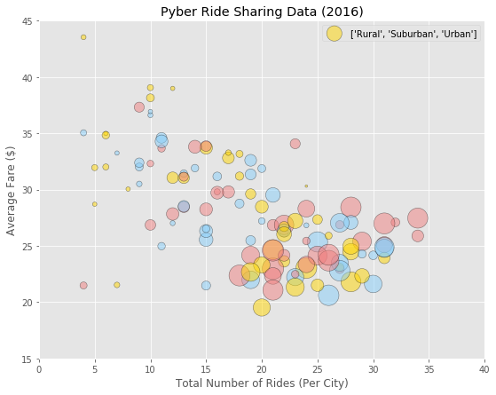
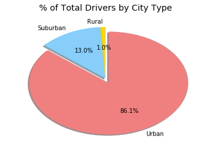

# Analysis
## Observed Trends
### 1. Average Fare is being low in Rural Areas, Medium in Suburban and comparatively High in Urban.
### 2. Number of people opting for Rides has been very low in Rural areas when compared to Suburban and Urban Areas.
### 3. Maximum number of drivers are from Urban.

```python
# Import modules
import csv
import pandas as pd
import os
import matplotlib.pyplot as plt
```


```python
# Read csv file
csv_path1 = os.path.join('raw_data','city_data.csv')
csv_path2 = os.path.join('raw_data','ride_data.csv')
# Get city and ride data into a DataFrame
city_df = pd.read_csv(csv_path1)
ride_df = pd.read_csv(csv_path2)
# Merge City and Ride Data
city_ride = city_df.merge(ride_df)
city_ride.head()
```


<div>
<style>
    .dataframe thead tr:only-child th {
        text-align: right;
    }

    .dataframe thead th {
        text-align: left;
    }

    .dataframe tbody tr th {
        vertical-align: top;
    }
</style>
<table border="1" class="dataframe">
  <thead>
    <tr style="text-align: right;">
      <th></th>
      <th>city</th>
      <th>driver_count</th>
      <th>type</th>
      <th>date</th>
      <th>fare</th>
      <th>ride_id</th>
    </tr>
  </thead>
  <tbody>
    <tr>
      <th>0</th>
      <td>Kelseyland</td>
      <td>63</td>
      <td>Urban</td>
      <td>2016-08-19 04:27:52</td>
      <td>5.51</td>
      <td>6246006544795</td>
    </tr>
    <tr>
      <th>1</th>
      <td>Kelseyland</td>
      <td>63</td>
      <td>Urban</td>
      <td>2016-04-17 06:59:50</td>
      <td>5.54</td>
      <td>7466473222333</td>
    </tr>
    <tr>
      <th>2</th>
      <td>Kelseyland</td>
      <td>63</td>
      <td>Urban</td>
      <td>2016-05-04 15:06:07</td>
      <td>30.54</td>
      <td>2140501382736</td>
    </tr>
    <tr>
      <th>3</th>
      <td>Kelseyland</td>
      <td>63</td>
      <td>Urban</td>
      <td>2016-01-25 20:44:56</td>
      <td>12.08</td>
      <td>1896987891309</td>
    </tr>
    <tr>
      <th>4</th>
      <td>Kelseyland</td>
      <td>63</td>
      <td>Urban</td>
      <td>2016-08-09 18:19:47</td>
      <td>17.91</td>
      <td>8784212854829</td>
    </tr>
  </tbody>
</table>
</div>


```python
# Group Data based on City
city_group = city_ride.groupby(["city"])
# Calculate Average Fare 
avg_fare = city_group["fare"].mean()
# Calculate Ride Count
ride_count = city_group["ride_id"].count()
# Create a DataFrame
temp_df = pd.DataFrame({                       
                       "average_fair": avg_fare,
                       "ride_count": ride_count
                       })

pyber_df = temp_df.merge(city_df, left_index=True, right_on="city")
pyber_df = pyber_df[["type","city","average_fair","ride_count","driver_count"]]
pyber_df.set_index("city").head()
# print(pyber_df.count())
# print(pyber_df.groupby("type")["driver_count"].sum())
```


<div>
<style>
    .dataframe thead tr:only-child th {
        text-align: right;
    }

    .dataframe thead th {
        text-align: left;
    }

    .dataframe tbody tr th {
        vertical-align: top;
    }
</style>
<table border="1" class="dataframe">
  <thead>
    <tr style="text-align: right;">
      <th></th>
      <th>type</th>
      <th>average_fair</th>
      <th>ride_count</th>
      <th>driver_count</th>
    </tr>
    <tr>
      <th>city</th>
      <th></th>
      <th></th>
      <th></th>
      <th></th>
    </tr>
  </thead>
  <tbody>
    <tr>
      <th>Alvarezhaven</th>
      <td>Urban</td>
      <td>23.928710</td>
      <td>31</td>
      <td>21</td>
    </tr>
    <tr>
      <th>Alyssaberg</th>
      <td>Urban</td>
      <td>20.609615</td>
      <td>26</td>
      <td>67</td>
    </tr>
    <tr>
      <th>Anitamouth</th>
      <td>Suburban</td>
      <td>37.315556</td>
      <td>9</td>
      <td>16</td>
    </tr>
    <tr>
      <th>Antoniomouth</th>
      <td>Urban</td>
      <td>23.625000</td>
      <td>22</td>
      <td>21</td>
    </tr>
    <tr>
      <th>Aprilchester</th>
      <td>Urban</td>
      <td>21.981579</td>
      <td>19</td>
      <td>49</td>
    </tr>
  </tbody>
</table>
</div>


```python
# Bubble Plot of Ride Sharing Data - Plot #1
# Set the Data for Bubble Plot
x = pyber_df["ride_count"]
y = pyber_df["average_fair"]
size = pyber_df["driver_count"]
colors = ['gold', 'lightskyblue', 'lightcoral']
city_type = ['Rural','Suburban','Urban']

# Set Graph Properties
plt.style.use('ggplot')
fig = plt.figure(figsize=(9,7))
plt.scatter(x,y, s=size*8, c=colors, alpha=0.5, edgecolor='black',label=city_type)
plt.legend(loc="best")
plt.xlabel('Total Number of Rides (Per City)')
plt.ylabel('Average Fare ($)')
plt.title('Pyber Ride Sharing Data (2016)') 

plt.xlim(0,40)
plt.ylim(15,45)

# Save the figure
plt.savefig("Ride_Sharing.png")

# Show Plot
plt.show()

```





```python
# Split the data by City Type
urban_df = pyber_df[pyber_df["type"] == "Urban"]
suburb_df = pyber_df[pyber_df["type"] == "Suburban"]
rural_df = pyber_df[pyber_df["type"] == "Rural"]

# Plot Graph
fig = plt.figure(figsize=(9,7))
urban = plt.scatter(urban_df["ride_count"],urban_df["average_fair"], s=urban_df["driver_count"]*8, c='lightcoral', alpha=0.7, edgecolor='black',label="Urban")
suburb = plt.scatter(suburb_df["ride_count"],suburb_df["average_fair"], s=suburb_df["driver_count"]*8, c='lightskyblue', alpha=0.7, edgecolor='black',label="Suburban")
rural = plt.scatter(rural_df["ride_count"],rural_df["average_fair"], s=rural_df["driver_count"]*8, c='gold', alpha=0.7, edgecolor='black',label="Rural")

# Set Graph properties
plt.legend(loc="best")
plt.xlim(0,40)
plt.ylim(15,45)
plt.xlabel('Total Number of Rides (Per City)')
plt.ylabel('Average Fare ($)')
plt.title('Pyber Ride Sharing Data (2016)') 
plt.text(42, 35, 'Note:')
plt.text(42, 34, 'Circle size correlates with driver count per city.')
# Save the figure
plt.savefig("Ride_Sharing_3.png")

# Show Plot
plt.show()

```


```python
# Pie Charts
# 1.% of Total Fares by City Type
# Group Data based on City Type for Pie Chart
city_type_group = city_ride.groupby("type")
# Calculate Total Fair
total_fare = city_ride["fare"].sum()
# Calculate Percentage Fare for each City Type
fare_percentage = round(((city_type_group["fare"].sum()/total_fare)*100),2)
# Set the labels and colors of Pie
labels = ["Rural","Suburban","Urban"]
colors = ['gold', 'lightskyblue', 'lightcoral']
sizes = fare_percentage
explode = (0, 0, 0.1)  # only "explode" the 3rd slice (i.e. 'Urban')
# Plot Pie Chart
fig1, ax1 = plt.subplots()
ax1.pie(sizes, explode=explode, colors=colors, labels=labels, autopct='%1.1f%%',shadow=True, startangle=90)
# ax1.axis('equal')  # Equal aspect ratio ensures that pie is drawn as a circle.
plt.title("% of Total Fares by City Type")
# Show Plot
plt.show()

```


```python
# 2.% of Total Rides by City Type
# Calculate Total Rides
total_rides = city_ride["ride_id"].count()
# Calculate Ride Percentage
ride_percentage = round(((city_type_group["ride_id"].count()/total_rides)*100),2)
sizes = ride_percentage
explode = (0, 0, 0.1)  # only "explode" the 3rd slice (i.e. 'Urban')
# Plot Pie chart
fig1, ax1 = plt.subplots()
ax1.pie(sizes, explode=explode, colors=colors, labels=labels, autopct='%1.1f%%',
        shadow=True, startangle=90)
ax1.axis('equal')  # Equal aspect ratio ensures that pie is drawn as a circle.

plt.title("% of Total Rides by City Type")
# Show Plot
plt.show()
```


```python
# 3. % of Total Drivers by City Type
# Calculate Total Driver Count
total_driver_count = city_ride["driver_count"].sum()
# Calculate Percentage of Total Drivers
driver_percentage = round(((city_type_group["driver_count"].sum()/total_driver_count)*100),2)

sizes = driver_percentage
explode = (0, 0, 0.1)  # only "explode" the 3rd slice (i.e. 'Urban')

fig1, ax1 = plt.subplots()
ax1.pie(sizes, explode=explode, colors=colors, labels=labels, autopct='%1.1f%%',
        shadow=True, startangle=90)
# ax1.axis('equal')  # Equal aspect ratio ensures that pie is drawn as a circle.
plt.title("% of Total Drivers by City Type")

# show plot
plt.show()
```




