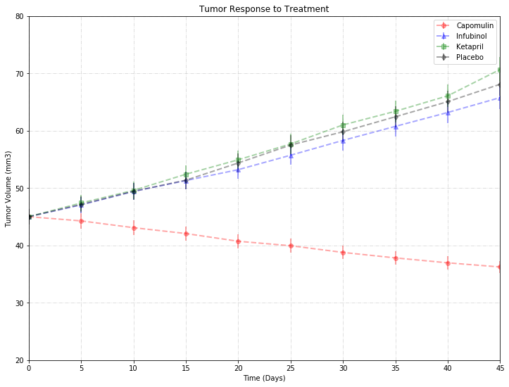
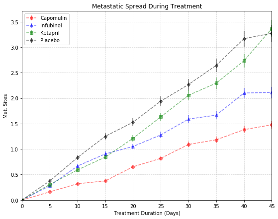
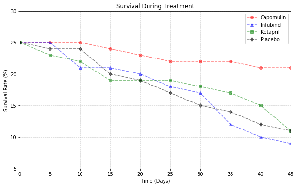
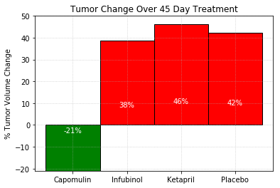

## Analysis

# Observed Trends
# 1. Except Capomulin, other 3 drugs have more or less similar Tumor Response to the Treatment.
# 2. MetsStatic Spread is also less for Capomulin when compared to other 3 drugs Infubinol, Ketapril, and Placebo.
# 3. Ketapril has the highest % of Tumor Volume change which is 46%.

```python
# import modules
import csv
import pandas as pd
import os
import matplotlib.pyplot as plt
```


```python
# read csv file
csv_path1 = os.path.join('raw_data','clinicaltrial_data.csv')
csv_path2 = os.path.join('raw_data','mouse_drug_data.csv')
# place csv data into a DataFrame
clinic_df = pd.read_csv(csv_path1)
mouse_drug_df = pd.read_csv(csv_path2)
```


```python
# Merge Clinical and Drug Data
pharma_df = mouse_drug_df.merge(clinic_df)
# Filter Data as our objective is to analyze the data to show how four treatments 
# (Capomulin, Infubinol, Ketapril, and Placebo) and compare
pharma_slice_df = pharma_df.loc[(pharma_df['Drug'] == 'Capomulin') |  (pharma_df['Drug'] == 'Infubinol') |
                                (pharma_df['Drug'] == 'Ketapril') | (pharma_df['Drug'] == 'Placebo')]
pharma_slice_df.head()
```


<div>
<style>
    .dataframe thead tr:only-child th {
        text-align: right;
    }

    .dataframe thead th {
        text-align: left;
    }

    .dataframe tbody tr th {
        vertical-align: top;
    }
</style>
<table border="1" class="dataframe">
  <thead>
    <tr style="text-align: right;">
      <th></th>
      <th>Mouse ID</th>
      <th>Drug</th>
      <th>Timepoint</th>
      <th>Tumor Volume (mm3)</th>
      <th>Metastatic Sites</th>
    </tr>
  </thead>
  <tbody>
    <tr>
      <th>393</th>
      <td>q119</td>
      <td>Ketapril</td>
      <td>0</td>
      <td>45.000000</td>
      <td>0</td>
    </tr>
    <tr>
      <th>394</th>
      <td>q119</td>
      <td>Ketapril</td>
      <td>5</td>
      <td>47.864440</td>
      <td>0</td>
    </tr>
    <tr>
      <th>395</th>
      <td>q119</td>
      <td>Ketapril</td>
      <td>10</td>
      <td>51.236606</td>
      <td>0</td>
    </tr>
    <tr>
      <th>396</th>
      <td>n923</td>
      <td>Ketapril</td>
      <td>0</td>
      <td>45.000000</td>
      <td>0</td>
    </tr>
    <tr>
      <th>397</th>
      <td>n923</td>
      <td>Ketapril</td>
      <td>5</td>
      <td>45.824881</td>
      <td>0</td>
    </tr>
  </tbody>
</table>
</div>


```python
# Group Data based on Drug and Timepoint
tumor_vol_group = pharma_slice_df.groupby(['Drug','Timepoint'])['Tumor Volume (mm3)'].mean()
tumor_vol_df = pd.DataFrame(tumor_vol_group)
tumor_vol_df.head()
```


<div>
<style>
    .dataframe thead tr:only-child th {
        text-align: right;
    }

    .dataframe thead th {
        text-align: left;
    }

    .dataframe tbody tr th {
        vertical-align: top;
    }
</style>
<table border="1" class="dataframe">
  <thead>
    <tr style="text-align: right;">
      <th></th>
      <th></th>
      <th>Tumor Volume (mm3)</th>
    </tr>
    <tr>
      <th>Drug</th>
      <th>Timepoint</th>
      <th></th>
    </tr>
  </thead>
  <tbody>
    <tr>
      <th rowspan="5" valign="top">Capomulin</th>
      <th>0</th>
      <td>45.000000</td>
    </tr>
    <tr>
      <th>5</th>
      <td>44.266086</td>
    </tr>
    <tr>
      <th>10</th>
      <td>43.084291</td>
    </tr>
    <tr>
      <th>15</th>
      <td>42.064317</td>
    </tr>
    <tr>
      <th>20</th>
      <td>40.716325</td>
    </tr>
  </tbody>
</table>
</div>


```python
# Organize data
tumor_vol_df = tumor_vol_df.reset_index()
tumor_vol_df = tumor_vol_df.pivot(index='Timepoint', columns='Drug', values='Tumor Volume (mm3)')
tumor_vol_df.head()
```


<div>
<style>
    .dataframe thead tr:only-child th {
        text-align: right;
    }

    .dataframe thead th {
        text-align: left;
    }

    .dataframe tbody tr th {
        vertical-align: top;
    }
</style>
<table border="1" class="dataframe">
  <thead>
    <tr style="text-align: right;">
      <th>Drug</th>
      <th>Capomulin</th>
      <th>Infubinol</th>
      <th>Ketapril</th>
      <th>Placebo</th>
    </tr>
    <tr>
      <th>Timepoint</th>
      <th></th>
      <th></th>
      <th></th>
      <th></th>
    </tr>
  </thead>
  <tbody>
    <tr>
      <th>0</th>
      <td>45.000000</td>
      <td>45.000000</td>
      <td>45.000000</td>
      <td>45.000000</td>
    </tr>
    <tr>
      <th>5</th>
      <td>44.266086</td>
      <td>47.062001</td>
      <td>47.389175</td>
      <td>47.125589</td>
    </tr>
    <tr>
      <th>10</th>
      <td>43.084291</td>
      <td>49.403909</td>
      <td>49.582269</td>
      <td>49.423329</td>
    </tr>
    <tr>
      <th>15</th>
      <td>42.064317</td>
      <td>51.296397</td>
      <td>52.399974</td>
      <td>51.359742</td>
    </tr>
    <tr>
      <th>20</th>
      <td>40.716325</td>
      <td>53.197691</td>
      <td>54.920935</td>
      <td>54.364417</td>
    </tr>
  </tbody>
</table>
</div>


```python
# 1. Creating a scatter plot that shows how the tumor volume changes over time for each treatment.
# set plot size
fig = plt.figure(figsize=(12,9))
# set color, marker and list of drugs
colors = ["red","blue","green","black"]
marker = ['o','^','s','d']
drugs_list = tumor_vol_df.columns

# Plot graph for each drug
i=0
for drug in drugs_list:
    plt.errorbar(tumor_vol_df.index,tumor_vol_df[drug], yerr= 0.03 * tumor_vol_df[drug], ls='--', lw=2.0, alpha=0.35,
                 c=colors[i],label=drug, marker=marker[i])
    i += 1
    
# Set graph properties - title, label, legend and limits
plt.grid(True, ls='-.', alpha=0.5)
plt.xlim(0,45)
plt.ylim(20,80)
plt.xlabel("Time (Days)")
plt.ylabel("Tumor Volume (mm3)")
plt.title("Tumor Response to Treatment")
plt.legend(loc="best")

# Save the figure
plt.savefig("Tumor_Response.png")

# Show Plot
plt.show()
```





```python
# Group Data based on Drug and Timepoint
metastatic_group = pharma_slice_df.groupby(['Drug','Timepoint'])['Metastatic Sites'].mean()
metastatic_df = pd.DataFrame(metastatic_group)
metastatic_df.head()
```


<div>
<style>
    .dataframe thead tr:only-child th {
        text-align: right;
    }

    .dataframe thead th {
        text-align: left;
    }

    .dataframe tbody tr th {
        vertical-align: top;
    }
</style>
<table border="1" class="dataframe">
  <thead>
    <tr style="text-align: right;">
      <th></th>
      <th></th>
      <th>Metastatic Sites</th>
    </tr>
    <tr>
      <th>Drug</th>
      <th>Timepoint</th>
      <th></th>
    </tr>
  </thead>
  <tbody>
    <tr>
      <th rowspan="5" valign="top">Capomulin</th>
      <th>0</th>
      <td>0.000000</td>
    </tr>
    <tr>
      <th>5</th>
      <td>0.160000</td>
    </tr>
    <tr>
      <th>10</th>
      <td>0.320000</td>
    </tr>
    <tr>
      <th>15</th>
      <td>0.375000</td>
    </tr>
    <tr>
      <th>20</th>
      <td>0.652174</td>
    </tr>
  </tbody>
</table>
</div>


```python
# Organize Data
metastatic_df = metastatic_df.reset_index()
metastatic_df = metastatic_df.pivot(index='Timepoint', columns='Drug', values='Metastatic Sites')
metastatic_df.head()
```


<div>
<style>
    .dataframe thead tr:only-child th {
        text-align: right;
    }

    .dataframe thead th {
        text-align: left;
    }

    .dataframe tbody tr th {
        vertical-align: top;
    }
</style>
<table border="1" class="dataframe">
  <thead>
    <tr style="text-align: right;">
      <th>Drug</th>
      <th>Capomulin</th>
      <th>Infubinol</th>
      <th>Ketapril</th>
      <th>Placebo</th>
    </tr>
    <tr>
      <th>Timepoint</th>
      <th></th>
      <th></th>
      <th></th>
      <th></th>
    </tr>
  </thead>
  <tbody>
    <tr>
      <th>0</th>
      <td>0.000000</td>
      <td>0.000000</td>
      <td>0.000000</td>
      <td>0.000000</td>
    </tr>
    <tr>
      <th>5</th>
      <td>0.160000</td>
      <td>0.280000</td>
      <td>0.304348</td>
      <td>0.375000</td>
    </tr>
    <tr>
      <th>10</th>
      <td>0.320000</td>
      <td>0.666667</td>
      <td>0.590909</td>
      <td>0.833333</td>
    </tr>
    <tr>
      <th>15</th>
      <td>0.375000</td>
      <td>0.904762</td>
      <td>0.842105</td>
      <td>1.250000</td>
    </tr>
    <tr>
      <th>20</th>
      <td>0.652174</td>
      <td>1.050000</td>
      <td>1.210526</td>
      <td>1.526316</td>
    </tr>
  </tbody>
</table>
</div>


```python
# Plot graph
fig = plt.figure(figsize=(9,7))
i=0
for drug in drugs_list:
    plt.errorbar(metastatic_df.index, metastatic_df[drug], yerr=0.05*metastatic_df[drug], alpha=0.5,
                 linestyle= '--', c=colors[i], label=drug, marker=marker[i])
    i += 1
    
# Set Graph Properties
plt.grid(True, ls='--', alpha=0.5) 
plt.xlabel("Treatment Duration (Days)")
plt.ylabel("Met. Sites")
plt.xlim(0,45)
plt.ylim(0)
plt.title("Metastatic Spread During Treatment")
plt.legend(loc="best")

# Save the figure
plt.savefig("Metastatic_Spread.png")

# Show Plot
plt.show()
```





```python
# Calculate Mouse Survival Rate
survival_group = pharma_slice_df.groupby(['Drug','Timepoint'])['Mouse ID'].count()
survival_rate_df = pd.DataFrame(survival_group)
survival_rate_df.head()
```


<div>
<style>
    .dataframe thead tr:only-child th {
        text-align: right;
    }

    .dataframe thead th {
        text-align: left;
    }

    .dataframe tbody tr th {
        vertical-align: top;
    }
</style>
<table border="1" class="dataframe">
  <thead>
    <tr style="text-align: right;">
      <th></th>
      <th></th>
      <th>Mouse ID</th>
    </tr>
    <tr>
      <th>Drug</th>
      <th>Timepoint</th>
      <th></th>
    </tr>
  </thead>
  <tbody>
    <tr>
      <th rowspan="5" valign="top">Capomulin</th>
      <th>0</th>
      <td>25</td>
    </tr>
    <tr>
      <th>5</th>
      <td>25</td>
    </tr>
    <tr>
      <th>10</th>
      <td>25</td>
    </tr>
    <tr>
      <th>15</th>
      <td>24</td>
    </tr>
    <tr>
      <th>20</th>
      <td>23</td>
    </tr>
  </tbody>
</table>
</div>


```python
# Organize Data
survival_rate_df = survival_rate_df.reset_index()
survival_rate_df = survival_rate_df.pivot(index='Timepoint', columns='Drug', values='Mouse ID')
survival_rate_df.head()
```


<div>
<style>
    .dataframe thead tr:only-child th {
        text-align: right;
    }

    .dataframe thead th {
        text-align: left;
    }

    .dataframe tbody tr th {
        vertical-align: top;
    }
</style>
<table border="1" class="dataframe">
  <thead>
    <tr style="text-align: right;">
      <th>Drug</th>
      <th>Capomulin</th>
      <th>Infubinol</th>
      <th>Ketapril</th>
      <th>Placebo</th>
    </tr>
    <tr>
      <th>Timepoint</th>
      <th></th>
      <th></th>
      <th></th>
      <th></th>
    </tr>
  </thead>
  <tbody>
    <tr>
      <th>0</th>
      <td>25</td>
      <td>25</td>
      <td>25</td>
      <td>25</td>
    </tr>
    <tr>
      <th>5</th>
      <td>25</td>
      <td>25</td>
      <td>23</td>
      <td>24</td>
    </tr>
    <tr>
      <th>10</th>
      <td>25</td>
      <td>21</td>
      <td>22</td>
      <td>24</td>
    </tr>
    <tr>
      <th>15</th>
      <td>24</td>
      <td>21</td>
      <td>19</td>
      <td>20</td>
    </tr>
    <tr>
      <th>20</th>
      <td>23</td>
      <td>20</td>
      <td>19</td>
      <td>19</td>
    </tr>
  </tbody>
</table>
</div>


```python
# Plot Graph
fig = plt.figure(figsize=(10,6))
i=0
for drug in drugs_list:
    plt.errorbar(survival_rate_df.index, survival_rate_df[drug], alpha=0.5,
                 linestyle= '--', c=colors[i], label=drug, marker=marker[i])
    i += 1

# Set Graph Properties
plt.xlim(0,45) 
plt.ylim(5,30)
plt.xlabel("Time (Days)")
plt.ylabel("Survival Rate (%)")
plt.title("Survival During Treatment")
plt.grid(True, ls='--',alpha=0.5)
plt.legend(loc="best")

# Save the figure
plt.savefig("Survival_Rate.png")
# Show Plot
plt.show()
```





```python
# Summary Bar Graph
# Calculate Percentage Change on Tumor Volume (mm3)
tumor_vol_pc_df = tumor_vol_df.pct_change().sum()*100
tumor_vol_pc_df.fillna(0)
tumor_vol_pc_df
```


    Drug
    Capomulin   -21.391539
    Infubinol    38.746192
    Ketapril     46.308083
    Placebo      42.393592
    dtype: float64


```python
# Set values for X, Y axis and bar width
x = tumor_vol_pc_df.index
y = tumor_vol_pc_df
bar_width = 1
edgecolor = ['black','black','black','black']

# Set the color based on condition
colors = []
for value in y: # keys are the names of the boys
    if value > 0:
        colors.append('r')
    else:
        colors.append('g')
        
# Plot Bar Chart        
bars = plt.bar(x, y, bar_width, color=colors, ec=edgecolor, lw=1)

# Set Graph Properties
plt.ylabel('% Tumor Volume Change')
plt.title('Tumor Change Over 45 Day Treatment') 
plt.ylim(-21,50)
plt.grid(True,linestyle=':', alpha=0.7)

# Set the bar value inside each bar
for bar in bars:
        height = bar.get_height()
        plt.text(bar.get_x() + bar.get_width()/2., .2*height,
                '%s' % (str(int(height)) + '%'),
                ha='center', va='bottom', color="white")
# Save the figure
plt.savefig("Summary_BarGraph.png")

# Show graph
plt.show()
```




